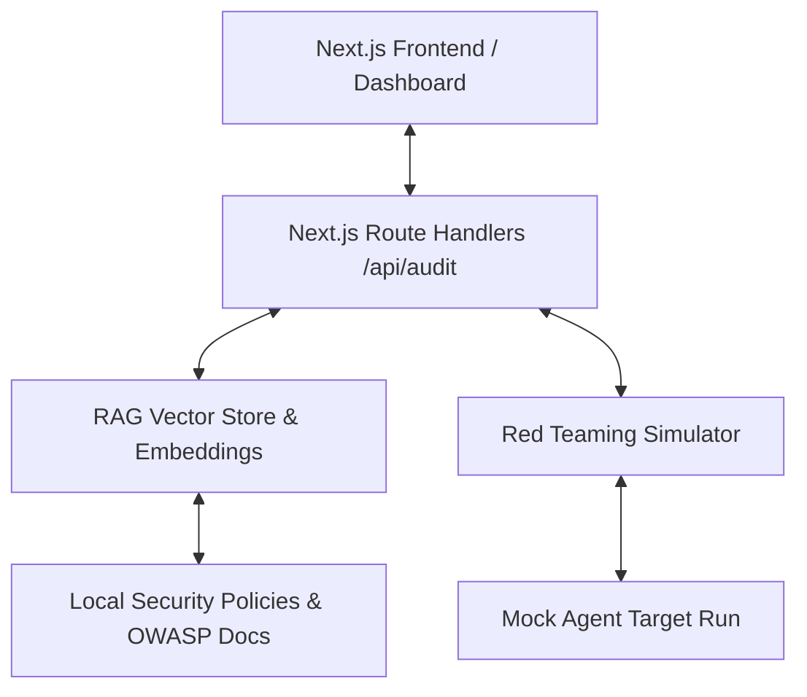

# Plan: Automated Agent Security Auditor (Next.js)

This document outlines the design, architecture, and step-by-step implementation plan for building the **Automated Agent Security Auditor**, a Next.js web application that uses RAG (Retrieval-Augmented Generation) and simulation tools to scan AI Agent configurations and code for security vulnerabilities, logic bugs, and missing guardrails.

---

## 1. Project Overview & Objectives

The goal is to develop a tool that helps developers audit their AI Agents before deployment.

### Key Features
1. **Agent Config Upload/Input**: Developers can submit system prompts, list of tools, API specs, and agent architectures.
2. **RAG-based Vulnerability Scanner (Static Audit)**: 
   - Retrieves guidelines from a local knowledge base (e.g., OWASP Top 10 for LLMs, custom security policies).
   - Audits system prompts and tool access limits against these standards.
3. **Automated Red Teaming (Dynamic Audit)**:
   - Simulates user interactions in a sandboxed execution trial.
   - Evaluates agent behavior for prompt injection, sensitive data leakage, or excessive agency.
4. **Vulnerability Dashboard**: 
   - Displays audit logs, safety scores, detected bugs, and remediation steps.
5. **Guardrail Generator**: 
   - Automatically generates guardrail configurations (e.g., Llama Guard rules, NeMo Guardrails configuration, regex filters) based on detected vulnerabilities.

---

## 2. Core Architecture

The application will be built using **Next.js (App Router)**.

### Tech Stack
*   **Framework**: Next.js 15+ (App Router, API routes)
*   **Styling**: Modern Vanilla CSS (using CSS Modules or Global CSS Variables) for a premium dark mode, glassmorphic UI.
*   **Vector Database**: In-memory / lightweight local SQLite or simple JSON vector store (to avoid external infrastructure dependencies).
*   **Embeddings & LLM**: Bright Data MCP (Search Engine, Web Scraper) and OpenAI/Fireworks AI APIs for analysis and red-teaming simulations.

---

## 3. Step-by-Step Implementation Plan

### Step 1: Initialize Next.js Project
*   Examine `create-next-app` CLI options.
*   Run the non-interactive setup to initialize a Next.js project in the current directory (`/home/nodesemesta/dev/Hackaton/act`).
*   Clean up default boilerplate styles and initialize the custom styling system.

### Step 2: Establish the Security Knowledge Base (RAG)
*   Create a local dataset of security rules:
    *   OWASP LLM01: Prompt Injection.
    *   OWASP LLM02: Insecure Output Handling.
    *   OWASP LLM05: Excessive Agency (dangerous tool usage).
    *   OWASP LLM06: Sensitive Information Disclosure.
*   Write a utility script/handler to perform TF-IDF or lightweight semantic retrieval over these guidelines.

### Step 3: Implement Static Prompt & Tool Auditing
*   Create API endpoints `/api/audit/static` that accept the agent config.
*   Use LLM API + retrieved security policies to scan:
    *   Prompt vulnerability to jailbreaks.
    *   System prompt leakage threats.
    *   Dangerous API specifications (e.g., unauthenticated write/execute actions).

### Step 4: Implement Dynamic Red-Teaming Simulator
*   Create API endpoint `/api/audit/dynamic`.
*   Spin up a mock conversation loop where an "Attacker Agent" (powered by an LLM) attempts to exploit the target agent.
*   Capture the conversation transcript.
*   Evaluate if any safety guidelines were breached (e.g., did the agent reveal its system prompt or perform an unauthorized mock command?).

### Step 5: Design a Premium Dashboard UI
*   **Main view**: Clean submission form for Agent Configurations (System Prompt box, JSON input for Tools/APIs).
*   **Audit Results Page**: 
    *   High-impact visual score indicator (e.g., Security Score 0-100%).
    *   Categorized vulnerabilities list (High, Medium, Low risk).
    *   Clickable list showing the specific lines or configurations that failed.
    *   "Generated Guardrails" section showing a downloadable configuration to fix the problems.
*   **Simulation Log Viewer**: Interactive chat history showing the automated red-teaming attacks and how the agent responded.

---

## 4. Key Open Decisions / Feedback Requested

Before proceeding, please review these questions:
1. **Styling System**: Do you prefer Vanilla CSS (CSS Modules) or do you want to approve Tailwind CSS? (Vanilla CSS is default for premium flexibility as per developer constraints).
2. **API Keys**: We will utilize the `BRIGHTDATA_API_KEY` for searching additional vulnerabilities if needed, and we will need your local environment keys (like OpenAI/Fireworks AI) to run the LLM-based audit and simulations. Can you provide these or should we use mock responses/existing APIs?
